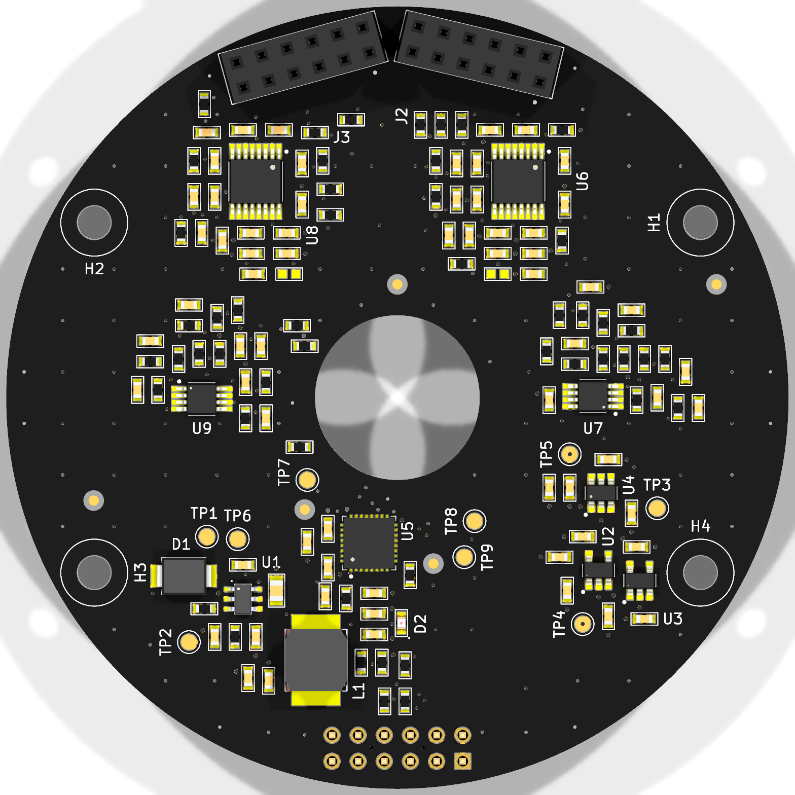

# PCBDesignWClaude: Inductive Absolute Encoder (branch `inductive-encoder`)

This branch holds a separate KiCad project from `main` (the 3-phase ESC): a contactless **absolute inductive rotary encoder**. It was designed with Claude Code and the PowerLab KiCad Assistant, after TI's **TIDA-010961** reference design ([TIDUFF8](https://www.ti.com/lit/pdf/tiduff8)).

- **Sensing:** dual-track Nonius coils, 16 and 15 periods, in a Ø58 mm coil area. The absolute angle comes from the phase difference between the two tracks.
- **Electronics:** 2 × LDC5072-Q1 inductive front ends, 2 × TLV9062 op-amps, an MSPM0G3507 MCU (both ADCs sample simultaneously) and a REF35330 3.3 V reference.
- **Power and interface:** 12–24 V input to an LMR51610 buck, then the TPS70950 and TPS70933 LDOs. The host connection carries UART at 2.5 Mbaud, SYNC and SWD.
- **Rules and parts:** the design follows the [METU PowerLab PCB design rules](https://github.com/odtu/Powerlab/blob/master/KiCAD/PCB_DESIGN_RULES.md) and uses parts from [PowerLabKiCadLibraries](https://github.com/odtu/PowerLabKiCadLibraries).



## Boards

The stack is the same as TI's: the target, a 0.5 mm air gap, the stator, then the 2×6 board-to-board headers, then the signal board.

| Board | Files | |
|---|---|---|
| Stator (coil board) | `InductiveEncoder.kicad_pro` | Ø76 mm, 4 layers. Generated coils, net ties, J2/J3 male headers on the bottom. No GND copper, so nothing acts as a shorted turn. |
| Signal board | `signal/EncoderSignal.kicad_pro` | Ø76 mm, 4 layers, the same M3 holes. All electronics. J2/J3 sockets on top, J1 host connector on the bottom. |
| Target | `target/EncoderTarget.kicad_pcb` | Ø56 mm, 2 layers, copper segments. It rotates with the shaft. |

## Status

- **Schematics:**
  - Hierarchical, on the PowerLab drawing sheet.
  - ERC: 0 errors.
  - PDFs: [docs/schematic_signal.pdf](docs/schematic_signal.pdf), [docs/schematic_stator.pdf](docs/schematic_stator.pdf).
- **Boards:**
  - DRC on both: 0 errors, 0 unconnected, 0 schematic-parity issues.
  - Remaining warnings: footprint-library mismatches (mask bridges allowed inside the fine-pitch ICs), one J1 silk circle near the edge, one narrow pour neck.
- **Fab outputs** in [fab/](fab/): Gerber and drill zip, BOM, position file and assembly drawings for each board.
- **Routing:**
  - The signal-board routing was reworked after [odtu/PowerLabKiCadAssistant#21](https://github.com/odtu/PowerLabKiCadAssistant/issues/21).
  - The resulting rules are proposed in odtu/Powerlab#147 and odtu/PowerLabKiCadAssistant#22. See "How the signal board was routed" below.

Before ordering:
- Add teardrops (Edit → Edit Teardrops; KiCad has no scripting API for them), then rerun `tools/fab_outputs.py`.
- Set the project number (`${PROJECTNUMBER}` is `TBD` in `tools/lab_setup.py`).
- Replace C4/C5 (22 µF 0603, 10 V) on the 6.1 V rail with 16–25 V parts. At 6.1 V they lose most of their capacitance to DC bias.
- The round boards need a panel for PCBWay assembly.
- There's no reverse-polarity protection: use a keyed cable.
- Firmware isn't part of this project.

## How the signal board was routed

`tools/route_signal.py` runs this chain on the placed board:

1. **`fanout.py`:**
   - **GND:** the pours connect the GND pads. A via goes at the pad only for decoupling caps and fine-pitch IC GND pins. Pads the pour can't reach got a via after routing.
   - **Fine-pitch power pins:** 0.25 mm neck-downs.
   - **Escape lanes:** kept free in front of fine-pitch pins.
2. **`power_route.py`:** the rails come first, at the 0.5 mm Power class width. Freerouting 2.4.1 ignores net-class widths.
3. **`autoroute.py signal`:** Freerouting 2.4.1 (Java 25) routes the signals. GND and the rails are keepouts, and the In1 GND plane is a plane layer.
4. **`maze_route.py`:** a grid A* router finishes what is still open. `ripup.py` frees a congested pin row first when needed.
5. **`track_opt.py`:**
   - Shortcuts detours with 45° segments and chamfers every corner of 90° or less.
   - Ends tracks straight at the pad centre.
   - Removes stubs and duplicates.
   - Widens Power/GND tracks to class width, with a 0.15 mm minimum for everything.

Afterwards, the finishing scripts add the rest:
- `zones.py signal`: the GND pours, slotted at 90° so they don't form a closed ring around the shaft;
- `lab_extras.py`: the stitching vias, the local fiducials at the MCU and the J1 labels;
- `silk.py` and `board_info.py`: the silkscreen and the board info.

The whole regeneration sequence, from coils and schematics to fab outputs, is in [docs/DESIGN_NOTES.md](docs/DESIGN_NOTES.md#regenerating).

## Repository layout

```
InductiveEncoder.kicad_*      stator project (root sheet + coils.kicad_sch)
signal/                       signal-board project (7 sheets)
target/                       target disc
tools/                        Python generators and layout/routing scripts (KiCad 10 python / system python)
fab/<board>/                  ordering files (Gerber+drill zip, BOM, pos, assembly PDFs)
docs/                         schematic PDFs, views, design notes
METUPowerLab_KiCadSchematicTemplate.kicad_wks   lab drawing sheet (also in signal/)
```

## Opening and regenerating

- **KiCad 10.**
  - The schematics and boards carry embedded copies of every symbol and footprint, so the project opens without extra libraries.
  - The new parts are on the `library/inductive-encoder-parts` branch of PowerLabKiCadLibraries: LDC5072, MSPM0G3507, TLV9062, REF35330, TPS709xx, the 2×6 header and socket, and some passives. That branch isn't released yet.
- **Generated files:** the `.kicad_sch` files are generated by `tools/encoder_circuit.py`, and the stator coils by `tools/coilgen.py`. Edit the scripts, not the generated sheets.
- **Tool paths:** some scripts have local paths you'll need to change on another machine:
  - the KiCad install, `C:/Program Files/KiCad/10.0`;
  - the PowerLab library and Assistant folders, used for logos, fiducials, Java 25 and Freerouting.

## License

See [license.txt](license.txt) (same as `main`).
